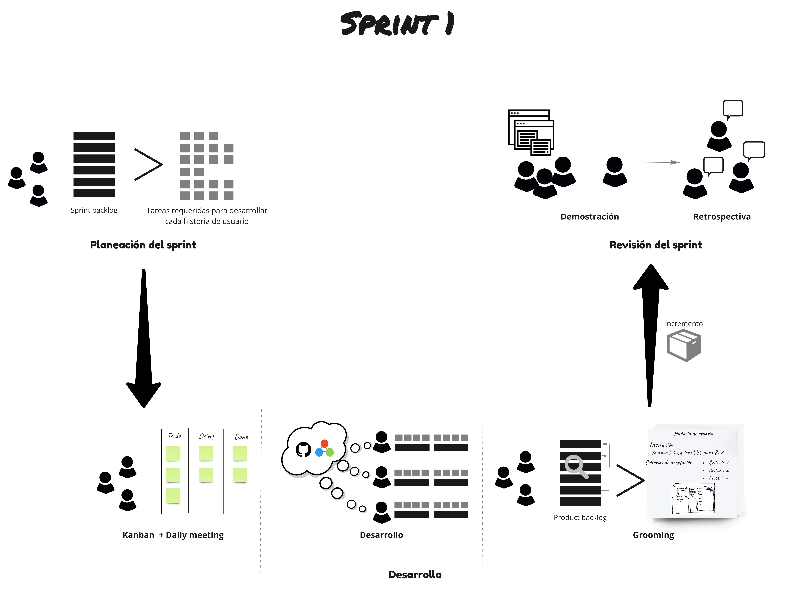

## Inception

### Objetivos
---
Los objetivos del Inception son:

 
### Resumen de las actividades
---

### Detalle de las actividades
---

<table>
  <tr>
   <td align="center" colspan="7"><b>Sprint 1</b></td>
  </tr>
  <tr>
    <td width="100px" ><b>Semana 4</b></td>
    <td><a href="https://avargas20.github.io/MISW-Procesos/semanas/sprint1/semana4/s4_planeacion_sprint">Planeación del sprint</a></td>
    <td rowspan="2" align="center"><a href="https://avargas20.github.io/MISW-Procesos/semanas/sprint1/semana4/s4_desarrollo">Desarrollo del proyecto</a></td>
    <td rowspan="2" align="center"><a href="https://avargas20.github.io/MISW-Procesos/semanas/sprint1/semana4/s4_seguimiento">Seguimiento</a></td>
    <td></td>
    <td></td>
    <td></td>
  </tr>
  <tr>
    <td width="100px"><b>Semana 5</b></td>
    <td></td>
    <td><a href="https://avargas20.github.io/MISW-Procesos/semanas/sprint1/semana5/s5_grooming">Grooming de historias</a></td>
    <td><a href="https://avargas20.github.io/MISW-Procesos/semanas/sprint1/semana5/s5_demo">Demostración del producto</a></td>
    <td><a href="https://avargas20.github.io/MISW-Procesos/semanas/sprint1/semana5/s5_retrospectiva">Retrospectiva</a></td>
  </tr>
</table>
