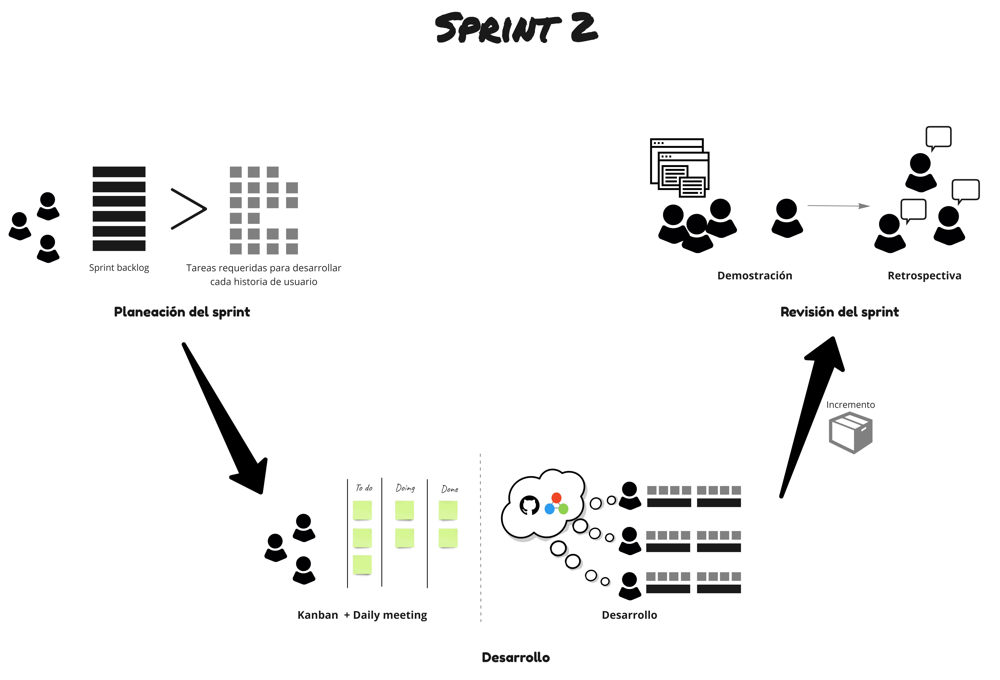

## Sprint 2

### Objetivos
---
Los objetivos del sprint son:

1. Realizar la planeación del sprint
2. Desarrollar las funcionalidades del Sprint Backlog teniendo en cuenta las prácticas vistas en cursos anteriores
3. Hacer seguimiento al avance de actividades del sprint mediante Daily meetings y tableros Kanban
4. Cerrar el segundo sprint de desarrollo y preparar la demostración para la *Revisión del Sprint*
5. Realizar la *Retrospectiva del sprint* a partir del análisis de las lecciones aprendidas en las dimensiones de equipo, proceso y producto
 
### Resumen de las actividades
---

### Detalle de las actividades
---

<table>
  <tr>
   <td align="center" colspan="6"><b>Sprint 2</b></td>
  </tr>
  <tr>
    <td width="100px" ><b>Semana 6</b></td>
    <td><a href="https://avargas20.github.io/MISW-Procesos/semanas/sprint2/semana6/s6_planeacion_sprint">Planeación del sprint</a></td>
    <td rowspan="2" align="center"><a href="https://avargas20.github.io/MISW-Procesos/semanas/sprint2/semana6/s6_desarrollo">Desarrollo del proyecto</a></td>
    <td rowspan="2" align="center"><a href="https://avargas20.github.io/MISW-Procesos/semanas/sprint2/semana6/s6_seguimiento">Seguimiento</a></td>
    <td></td>
    <td></td>
  </tr>
  <tr>
    <td width="100px"><b>Semana 7</b></td>
    <td></td>
    <td><a href="https://avargas20.github.io/MISW-Procesos/semanas/sprint2/semana7/s7_demo">Demostración del producto</a></td>
    <td><a href="https://avargas20.github.io/MISW-Procesos/semanas/sprint2/semana7/s7_retrospectiva">Retrospectiva</a></td>
  </tr>
</table>
